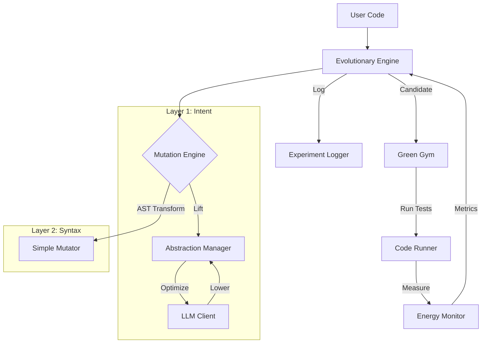

# HEDGE: Hierarchical Evolutionary Darwin-Green Engine

> **"Code optimization not as text prediction, but as multi-layered evolutionary search."**

HEDGE is an autonomous system designed to optimize software for **energy efficiency** and **performance**. Unlike traditional compilers or simple LLM-based refactoring tools, HEDGE treats code optimization as an evolutionary process occurring at multiple levels of abstraction.

## 🔬 The Research Idea (From Proposal)

The core hypothesis of HEDGE is that code optimization is best modeled as a **Hierarchical Evolutionary Process**.

### The Hierarchical Isomorphism Model
Code exists simultaneously at multiple layers of abstraction. HEDGE optimizes by traversing these layers:

1.  **Layer 1 (L1): Intent (Algorithmic)**
    *   *Representation*: High-level natural language or pseudocode summary of *what* the code does (e.g., "Sort a list of numbers").
    *   *Optimization*: Changing the algorithm itself (e.g., $O(n^2)$ Bubble Sort $\to$ $O(n \log n)$ Merge Sort).
    *   *Mechanism*: **Lifting** (Code $\to$ Intent) $\to$ **Mutation** (Optimize Intent) $\to$ **Lowering** (Intent $\to$ Code).

2.  **Layer 2 (L2): Syntax (Implementation)**
    *   *Representation*: Abstract Syntax Tree (AST) or source code.
    *   *Optimization*: Language-specific idioms (e.g., `for` loop $\to$ list comprehension, `range(len(x))` $\to$ `enumerate(x)`).
    *   *Mechanism*: Direct AST transformations or LLM-based refactoring.

3.  **Layer 3 (L3): Execution (Machine)**
    *   *Representation*: Bytecode or Machine Code.
    *   *Optimization*: Compiler flags, JIT settings.
    *   *(Planned for v2)*

### The Green Loop
HEDGE operates in a closed feedback loop called the **Green Loop**:
1.  **Mutate**: Generate variants using L1 or L2 strategies.
2.  **Validate**: Ensure functional correctness using unit tests.
3.  **Measure**: Execute in the **Green Gym** sandbox to measure Energy (Joules) and Time (s).
4.  **Select**: Keep variants that dominate the parent (Pareto optimization).

---

## 🛠️ Current Implementation

This repository contains a working **Proof-of-Concept (v1)** of HEDGE.

### Architecture



### Key Components

1.  **Green Gym (`src/green_gym/`)**:
    *   **`EnergyMonitor`**: Uses `codecarbon` to track energy consumption (with fallback to execution time).
    *   **`CodeRunner`**: Executes candidate code in a secure subprocess with timeouts to prevent infinite loops.

2.  **Abstraction Layer (`src/core/abstraction.py`)**:
    *   Implements the **Lifting** and **Lowering** logic.
    *   Currently uses a `MockLLMClient` for demonstration, simulating an LLM that "knows" how to optimize Bubble Sort to Merge Sort.

3.  **Mutation Engine (`src/mutator/`)**:
    *   **`LLMMutator`**: Performs L1 optimizations (Algorithm swap).
    *   **`SimpleMutator`**: Performs L2 optimizations (AST transformations).

4.  **Evolutionary Engine (`src/core/engine.py`)**:
    *   Orchestrates the loop.
    *   Manages the population.
    *   Logs detailed telemetry to `experiments/`.

---

## 🚀 Getting Started

### Prerequisites
*   Python 3.9+
*   Linux/WSL (for `codecarbon` best compatibility)

### Installation
```bash
# Clone the repository
git clone https://github.com/prakhar479/HEDGE.git
cd HEDGE

# Create virtual environment
python3 -m venv .env
source .env/bin/activate

# Install dependencies
pip install -r requirements.txt
```

### Running the Demo
We provide a sample "inefficient" target (`bubble_sort`) to demonstrate the system.

```bash
python main.py --target examples/target.py --tests examples/test_target.py --generations 3
```

**What happens?**
1.  **Baseline**: HEDGE runs the original `bubble_sort` and records energy/time.
2.  **Evolution**:
    *   **L1 Mutation**: The system "lifts" the code to "Sort a list", realizes it can be optimized, and "lowers" it to `sorted()` (Timsort).
    *   **L2 Mutation**: The system might try small syntactic tweaks.
3.  **Selection**: The `sorted()` variant is vastly faster and more energy-efficient, so it is selected.
4.  **Result**: The optimized code is saved to `examples/target_optimized.py`.

### Analyzing Results
Logs are saved in `experiments/<timestamp>/evolution.jsonl`. Each line represents an evaluation:
```json
{
  "generation": 1,
  "mutation_type": "LLMMutator",
  "metrics": {"energy_joules": 13.1, "duration_seconds": 0.5},
  "code_snippet": "return sorted(arr)..."
}
```

---

## 🔮 Roadmap (v2 & Beyond)

The current system is a foundation. The future of HEDGE involves:

1.  **Real LLM Integration**: Connecting to OpenAI/Anthropic APIs for true general-purpose optimization.
2.  **The Archive (MAP-Elites)**: Preserving diverse solutions (e.g., "Short code" vs "Fast code") to avoid local optima.
3.  **Multi-Objective Optimization**: Generating a Pareto Frontier of solutions (Energy vs Readability).
4.  **Compiler Evolution (L3)**: Optimizing compiler flags alongside source code.
