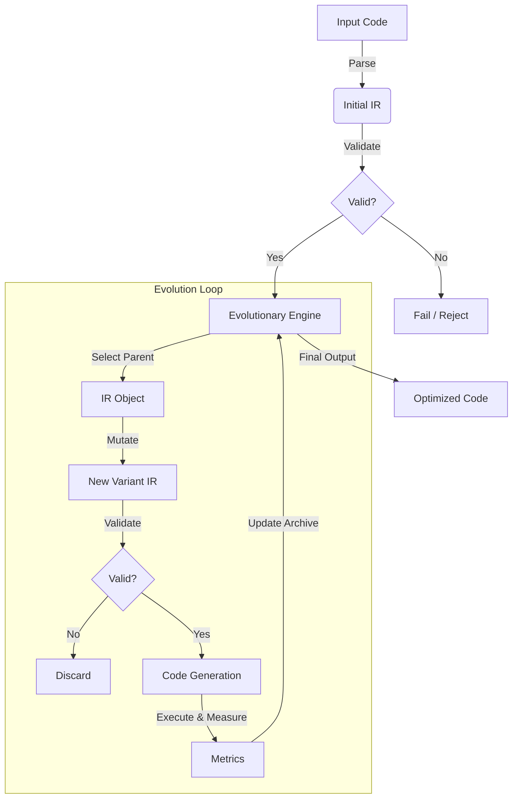

# HEDGE Architecture

## System Overview

HEDGE (Hierarchical Evolutionary Darwin-Green Engine) is a code optimization system built on a **strict IR-Only architecture**. Unlike traditional optimization that might operate on ASTs or string manipulation, HEDGE converts all Python code into a strongly-typed Intermediate Representation (IR) before performing any transformations.

### Core Principles

1.  **IR as Single Source of Truth**: All mutations, analysis, and validation happen on the IR.
2.  **Type Safety**: The IR is defined using Pydantic models, ensuring structural validity at the type level.
3.  **Validation Gates**: Every transformation is validated against the IR schema before code generation.
4.  **Pareto Optimization**: Solutions are evaluated on multi-objective criteria (Energy consumption vs Execution time).

## High-Level Pipeline

The optimization process follows a strict cyclical pipeline:

## Module Structure

### 1. Domain Layer (`src/domain/`)
The core business logic and data structures. Independent of external tools.

-   **`ir/schema.py`**: Defines the Unified IR using Pydantic models (e.g., `Statement`, `Expression`, `FunctionDef`).
-   **`ir/validators.py`**: Logic to ensure IR semantic correctness (e.g., variable scope usage).
-   **`ir/metrics.py`**: Calculator for complexity metrics (Cyclomatic complexity, depth, etc.).
-   **`interfaces.py`**: Abstract base classes for Mutators, Runners, etc.

### 2. Application Layer (`src/application/`)
Application logic, workflows, and mutation strategies.

-   **`engine/evolution.py`**: The `EvolutionaryEngine` class. Orchestrates the optimization loop, maintains the Pareto archive, and handles selection logic.
-   **`mutators/`**:
    -   `structural.py`: Tree-based mutations (renaming, swapping, loop unrolling).
    -   `semantic.py`: LLM-guided mutations (using Gemini/OpenAI).
    -   `advanced.py`: Compiler-like optimizations (Constant Folding, Dead Code Elimination).

### 3. Infrastructure Layer (`src/infrastructure/`)
Interfaces with the outside world (Filesystem, LLM APIs, Python Subprocesses).

-   **`parsing/python_parser.py`**: Converts Python source code into HEDGE IR.
-   **`codegen/python_codegen.py`**: Converts HEDGE IR back into executable Python code.
-   **`execution/runner.py`**: `GreenGymRunner`. Executes code in a sandbox, measures time and energy (via CodeCarbon).
-   **`llm/client.py`**: Clients for external LLM providers.

## The Intermediate Representation (IR)

The IR is a tree of Pydantic nodes (`src/domain/ir/schema.py`).

### Key Node Types
-   **`Module`**: Top-level container.
-   **`Statement`**: `FunctionDef`, `For`, `If`, `Assign`, `Return`, etc.
-   **`Expression`**: `BinaryOp`, `Call`, `Name`, `Constant`, etc.

### Benefits over AST
While similar to Python's abstract syntax tree (AST), the HEDGE IR:
-   Is strictly typed (runtime validation).
-   Is serializable to JSON/Dicts easily for storage/debugging.
-   Can be extended with metadata without breaking standard Python tools.

## Execution Flow

1.  **Initialization**: `hedge.py` CLI initializes the `EvolutionaryEngine`.
2.  **Parsing**: Target file is read and parsed into `IR`.
3.  **Baseline Evaluation**: Original code is run to establish baseline energy/time.
4.  **Generations**:
    -   **Selection**: Parents selected based on fitness (Energy * Time).
    -   **Mutation**: Mutators apply changes to deep copies of the IR.
    -   **Validation**: `IRValidator` checks for invalid structures.
    -   **Evaluation**: Valid IR is converted to code and executed.
5.  **Result**: Best solution (lowest energy) is saved.
